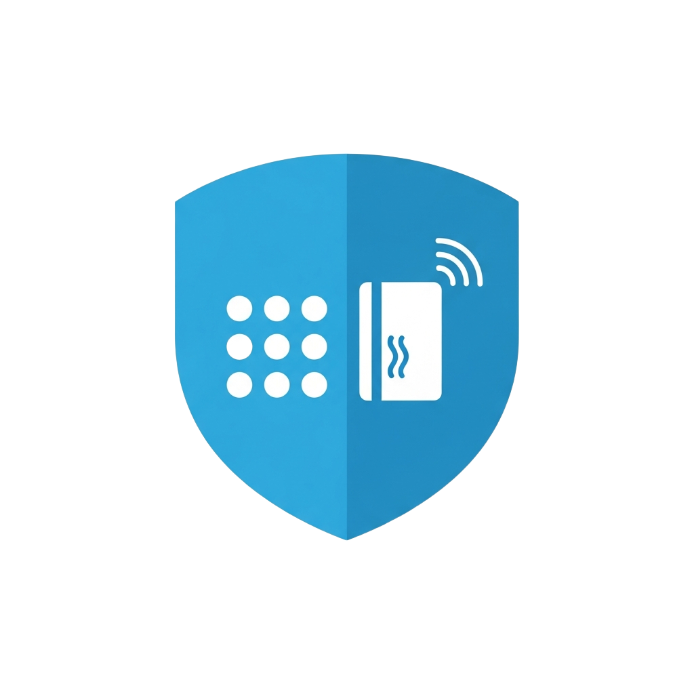

# RFID Access Control v1.2-betapin

<p align="center">
  
</p>

Integrazione custom per Home Assistant per gestire il controllo accessi tramite tastierino Zigbee KEPZB-110 con PIN e RFID.

## Funzionalita

- Gestione utenti con PIN e/o RFID
- Azioni personalizzate per ogni utente (accendi luci, apri serrature, ecc.)
- Card Lovelace con wizard guidato in italiano
- **Schermata di blocco con PIN admin** - protegge la lista utenti
- Blocco automatico dopo inattivita configurabile
- Selezione entita con servizi disponibili automatici
- Persistenza dati su file JSON
- Ascolto MQTT diretto dal tastierino (nessuna automazione necessaria)
- Compatibile con Zigbee2MQTT
- Sensore con lista utenti e stato accessi

## Installazione via HACS

1. Apri HACS in Home Assistant
2. Vai su **Integrazioni** → menu a 3 puntini → **Repository personalizzati**
3. Aggiungi URL: `https://github.com/EdisonACDC/rfid-access-control-v1.1`
4. Categoria: **Integrazione**
5. Cerca "RFID Access Control" e installa
6. Riavvia Home Assistant

## Installazione Manuale

1. Copia la cartella `custom_components/rfid_access_control/` nella cartella `custom_components/` di Home Assistant
2. Riavvia Home Assistant

## Configurazione

1. Vai su **Impostazioni** → **Integrazioni** → **+ Aggiungi Integrazione**
2. Cerca "RFID Access Control"
3. Inserisci:
   - **ID Dispositivo**: nome del tuo tastierino (es: `tastierino_portoncino`)
   - **Topic MQTT**: topic Zigbee2MQTT del tastierino (es: `zigbee2mqtt/tastierino_portoncino`)
4. L'integrazione ascolta automaticamente il tastierino via MQTT

## Configurazione Card Lovelace

1. Copia il file `custom_components/rfid_access_control/www/rfid-access-control-card.js` in `/config/www/`
2. Aggiungi la risorsa Lovelace:
   - Vai su **Impostazioni** → **Dashboard** → **Risorse**
   - Aggiungi `/local/rfid-access-control-card.js?v=1.2betapin`
   - Tipo: **Modulo JavaScript**
3. Aggiungi la card al dashboard con configurazione YAML:

```yaml
type: custom:rfid-access-control-card
entity: sensor.rfid_users_tastierino_portoncino
title: Controllo Accessi RFID
admin_pin: "1234"
lock_timeout: 5
```

### Parametri Card

| Parametro | Obbligatorio | Default | Descrizione |
|-----------|-------------|---------|-------------|
| `entity` | Si | - | Sensore dell'integrazione |
| `title` | No | Controllo Accessi RFID | Titolo della card |
| `admin_pin` | No | 11061988 | PIN per sbloccare la card |
| `lock_timeout` | No | 5 | Minuti prima del blocco automatico |

## Come Funziona

1. **Sblocca la card** inserendo il PIN admin
2. Crea gli utenti dalla card Lovelace (Nome → PIN → Azioni)
3. Quando qualcuno digita il PIN sul tastierino, l'integrazione:
   - Riceve il codice via MQTT
   - Cerca l'utente con quel PIN
   - Esegue tutte le azioni configurate per quell'utente
4. Eventi `rfid_access_granted` / `rfid_access_denied` vengono generati per eventuali notifiche
5. La card si **blocca automaticamente** dopo il timeout configurato

## Servizi Disponibili

| Servizio | Descrizione |
|----------|-------------|
| `rfid_access_control.add_user` | Aggiunge un nuovo utente |
| `rfid_access_control.remove_user` | Rimuove un utente |
| `rfid_access_control.update_user` | Aggiorna dati utente |
| `rfid_access_control.add_action` | Aggiunge azione a un utente |
| `rfid_access_control.remove_action` | Rimuove azione da un utente |
| `rfid_access_control.validate_access` | Valida credenziali ed esegue azioni |
| `rfid_access_control.list_users` | Elenca tutti gli utenti |

## Licenza

MIT
